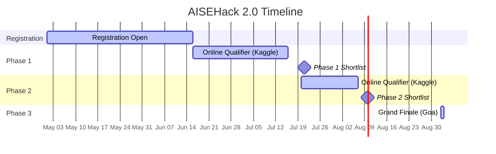

# ANRF AISEHack 2.0 — Polymer Property Prediction

> **India's premier research hackathon at the intersection of Artificial Intelligence, Science, and Engineering**
>
> Organized by the **Anusandhan National Research Foundation (ANRF)** in coordination with **Galaxeye** and **IIT Madras**.

---

## Table of Contents

- [Overview](#overview)
- [Competition Tracks](#competition-tracks)
- [Polymer Property Prediction — Deep Dive](#polymer-property-prediction--deep-dive)
- [Event Schedule](#event-schedule)
- [Rules & Guidelines](#rules--guidelines)
- [Prize Pool](#prize-pool)
- [FAQ](#faq)
- [Resources & Links](#resources--links)
- [Past Edition (AISEHack 1.0)](#past-edition-aisehack-10)

---

## Overview

**AISEHack 2.0** is the second edition of India's premier research hackathon organized by the Anusandhan National Research Foundation (ANRF). The hackathon focuses on applying Artificial Intelligence to solve critical challenges in **Science and Engineering**.

The mission: **"From Polymers to Galaxies"** — building high-impact AI solutions for Polymer Science and Space & Remote Sensing.

### Key Highlights

| Item | Detail |
|------|--------|
| **Full Name** | ANRF AISEHack 2.0 — AI for Science & Engineering Hackathon |
| **Edition** | 2nd Edition |
| **Grand Finale** | September 2–3, 2026 — Goa (offline) |
| **Platform** | Kaggle (private competition, invite-only) |
| **Organizer** | [Anusandhan National Research Foundation (ANRF)](https://anrf.gov.in) |
| **Coordinators** | [Galaxeye](https://galaxeye.space) · [IIT Madras](https://www.iitm.ac.in) |
| **Prize Pool** | To be announced |
| **Website** | [https://precog.iiit.ac.in/aisehack](https://precog.iiit.ac.in/aisehack) |
| **LinkedIn** | [ANRF India](https://www.linkedin.com/company/aisehack) |
| **Registration** | [Google Form](https://docs.google.com/forms/d/12EzeczXIiSJUyazcDZtvDaYsM2Q1dHbOsP3kxStrn30/viewform) |

---

## Competition Tracks

Two parallel tracks, one mission: **AI for science and engineering research**.

### Theme 1: Remote Sensing & Yield Prediction

| Item | Detail |
|------|--------|
| **Contributor** | Galaxeye |
| **Task** | Leverage remote sensing & geospatial data to build AI models for crop pattern detection and yield prediction at scale |
| **Focus Areas** | Geospatial AI, Remote Sensing, Foundation Models |
| **Kaggle Invite** | Coming soon (via registration email) |

### Theme 2: Polymer Property Prediction

| Item | Detail |
|------|--------|
| **Contributor** | IIT Madras |
| **Task** | Predict polymer properties from chemical structure (SMILES) using physics/operator-based deep learning |
| **Focus Areas** | Deep Learning, Neural Operators, Physics-Informed AI |
| **Kaggle Invite** | Coming soon (via registration email) |
| **Kaggle Page** | [https://www.kaggle.com/competitions/aisehack-2-0](https://www.kaggle.com/competitions/aisehack-2-0) |

---

## Polymer Property Prediction — Deep Dive

### Problem Statement

Better batteries, energy storage, materials, and drugs all depend on the right set of polymers. This competition challenges participants to develop machine learning models that can predict key polymer properties directly from their chemical structure, enabling virtual screening and accelerating materials discovery.

### Input

Polymer structures are provided as **SMILES (Simplified Molecular Input Line Entry System)** strings — a compact text representation of molecular structure. The asterisk (`*`) in the SMILES notation marks the polymerization point or chain extension position.

**Example SMILES strings:**
```
*/C=C/CC*
*CCC(C)C(*)C
*CC(*)C1CCCC(C)C1
```

### Target Properties

Unlike the NeurIPS Open Polymer Prediction 2025 (which targets 5 properties), **AISEHack 2.0 Polymer Track focuses on 2 key properties:**

| Property | Symbol | Description |
|----------|--------|-------------|
| **Glass Transition Temperature** | Tg (°C) | Temperature range where the polymer transitions from a hard, glassy state to a flexible, rubbery state |
| **Chain Band Gap** | Egc | Electronic band gap of the polymer chain — critical for applications in electronics, solar cells, and energy storage |

### Recommended Approaches

- **Deep Learning**: Graph Neural Networks (GNNs), Transformers for molecular representation
- **Neural Operators**: Physics-informed models that learn mappings between function spaces
- **Feature Engineering**: RDKit-based molecular descriptors, Morgan fingerprints, MACCS keys
- **Ensemble Methods**: XGBoost/LightGBM on learned embeddings

### Example Datasets

While the exact competition dataset is private (accessible only via Kaggle after registration), similar public datasets include:

| Dataset | Source | Description |
|---------|--------|-------------|
| Open Polymer Prediction | [Kaggle](https://www.kaggle.com/competitions/neurips-open-polymer-prediction-2025/) | 5 targets (Tg, FFV, Tc, Density, Rg), ~8K polymers |
| Polymer Genome | [Polymer Genome](https://www.polymergenome.org/) | Web-based ML for polymer property prediction |
| ADEPT Pipeline | [GitHub](https://github.com/sobinalosious/ADEPT) | Data generation pipeline generalizing to 25+ properties |

### Evaluation Metric

The competition uses the **Mean Coefficient of Determination (R²)** across both target properties:

```
Score = (R²_Tg + R²_Egc) / 2
```

Where R² is defined as:

```
R² = 1 - Σ(y_i - ŷ_i)² / Σ(y_i - ȳ)²
```

- **y_i** = ground truth values
- **ŷ_i** = predictions
- **ȳ** = mean of ground truth values

### Submission Format

Submissions must be a CSV file with the following format:

| id | target |
|----|--------|
| 1 | 220 |
| 2 | 2.3 |
| 3 | 110 |
| 4 | 70 |

- Each `id` in the test set requires a prediction based on its `target_type` (either Tg or Egc)
- Include a header row
- One prediction per row

---

## Event Schedule



| Phase | Dates | Description |
|-------|-------|-------------|
| **Registration Open** | Until June 16, 2026 | Complete registration form; Kaggle invites sent via email |
| **Phase 1: Online Qualifier** | Jun 16 – Jul 16, 2026 | Private Kaggle competition; submit best models |
| **Phase 1 Shortlist** | 3rd Week of July 2026 | Top teams announced via email & website |
| **Phase 2: Online Qualifier** | Jul 20 – Aug 7, 2026 | Second sprint on Kaggle; tougher tasks |
| **Phase 2 Shortlist** | 2nd Week of August 2026 | Finalists announced; Grand Finale data released |
| **Phase 3: Grand Finale** | Sep 2–3, 2026 | 3-day offline sprint in Goa; sponsored attendance |

---

## Rules & Guidelines

### General Rules

1. **Notebook-Only Competition** — All submissions must be backed by a compliant Kaggle Notebook.
2. **Reproducibility Requirement** — Your notebook must reproduce submitted results end-to-end.
3. **Compute Allocation** — 30 hours/week/participant of Kaggle GPU compute.
4. **External Data & Artifact Restrictions** — No private artifacts, external datasets, or pre-trained weights allowed.
5. **Phase 3 (Goa)** — Nominal on-campus fee; travel arranged by participants.

> **Note:** Successful leaderboard placement does not guarantee eligibility unless all requirements above are satisfied. For full rules, see the Rules tab on each theme's Kaggle page once invites are sent.

### Disqualification Criteria

- Non-compliance with notebook-only submission policy
- Use of unauthorized external data or pre-trained models
- Failure to reproduce results
- Code not running within allocated compute limits

---

## Prize Pool

The total prize pool is currently **to be announced** (listed as placeholder on the website). For reference, AISEHack 1.0 had a prize pool of **₹7,00,000** across both tracks.

---

## FAQ

### Who can participate in AISEHack?

Open to researchers, engineers, and AI enthusiasts. Specific eligibility details will be provided on the official website and registration form.

### What is the team size?

To be confirmed on the official rules page.

### Is there a registration fee?

Details to be confirmed. Phase 3 (Grand Finale) has a nominal on-campus fee.

### How do I receive the Kaggle competition invite?

Kaggle competition links are accessible only after completing registration via the Google Form. Invites are sent to your registered email — ensure accuracy.

### How much compute do I get?

30 hours/week/participant of Kaggle GPU compute.

### Where is the Grand Finale held?

Goa (3-day offline sprint). Finalists are sponsored to attend.

### Is travel to Goa covered?

Travel is to be arranged by participants. Finalists receive sponsorship for attendance.

### What datasets and problem statements will be provided?

Datasets and full problem statements are released via the private Kaggle competition after registration. Phase 2 and Grand Finale feature updated/tougher datasets.

---

## Resources & Links

| Resource | Link |
|----------|------|
| Official Website | [https://precog.iiit.ac.in/aisehack](https://precog.iiit.ac.in/aisehack) |
| Kaggle Competition | [https://www.kaggle.com/competitions/aisehack-2-0](https://www.kaggle.com/competitions/aisehack-2-0) |
| Registration Form | [Google Form](https://docs.google.com/forms/d/12EzeczXIiSJUyazcDZtvDaYsM2Q1dHbOsP3kxStrn30/viewform) |
| LinkedIn Updates | [ANRF India](https://www.linkedin.com/company/aisehack) |
| ANRF | [https://anrf.gov.in](https://anrf.gov.in) |
| Galaxeye | [https://galaxeye.space](https://galaxeye.space) |
| IIT Madras | [https://www.iitm.ac.in](https://www.iitm.ac.in) |
| Contact Email | [contact@aisehack.in](mailto:contact@aisehack.in) |

### Reference Notebooks

| Notebook | Author | Description |
|----------|--------|-------------|
| AISEHack 2.0 EDA/Model | [hmnshudhmn24](https://www.kaggle.com/code/hmnshudhmn24/anrf-aisehack-2-0-polymer-property-prediction) | Example notebook on the AISEHack 2.0 data |
| Open Polymer Tutorial | [Alex Liu](https://www.kaggle.com/code/alexliu99/tutorial) | Official tutorial for the NeurIPS polymer competition |

### Related Tools & Libraries

| Tool | Link | Description |
|------|------|-------------|
| RDKit | [https://www.rdkit.org/](https://www.rdkit.org/) | Cheminformatics toolkit for molecular descriptors & fingerprints |
| torch-molecule | [GitHub](https://github.com/liugangcode/torch-molecule) | PyTorch-based molecular ML library |
| PolymerGNN | [GitHub](https://github.com/owencqueen/PolymerGNN) | Graph neural networks for polymer property prediction |
| ADEPT | [GitHub](https://github.com/sobinalosious/ADEPT) | Data generation pipeline for polymer properties |
| Polymer Genome | [https://www.polymergenome.org/](https://www.polymergenome.org/) | Web-based ML polymer property prediction |

---

## Past Edition (AISEHack 1.0)

| Item | Detail |
|------|--------|
| **Theme** | Climate & Sustainability |
| **Dates** | April 4–5, 2026 |
| **Venue** | IIIT Hyderabad |
| **Prize Pool** | ₹7,00,000 |
| **Teams** | 50+ finalists |
| **Coordinators** | IBM (Flood Detection) · IIT Delhi (Pollution Forecasting) |

### Tracks & Winners

#### Track 1: Flood Detection (IBM)

| Position | Team | Lead |
|----------|------|------|
| 1st | Triverse | Jatin |
| 2nd | MEGALODON | Bhaskar |
| 3rd | Achievers | Shashwat Mishra |

#### Track 2: Pollution Forecasting (IIT Delhi)

| Position | Team | Lead |
|----------|------|------|
| 1st | VibeCoders | Pranav Mundhra |
| 2nd | Ctrl+alt+Defeat | Parthiv Kalikota |
| 3rd | LuVW | Gautam Gandhi |

### Past Edition Showcase

[Full showcase of all finalist teams, reports, code & slides](https://precog.iiit.ac.in/aisehack/past-editions/edition-1/showcase)

---

> *"Are you ready to turn code into an explorer of the macro and micro?"*
>
> — **ANRF AISEHack 2.0**
