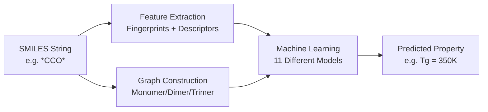
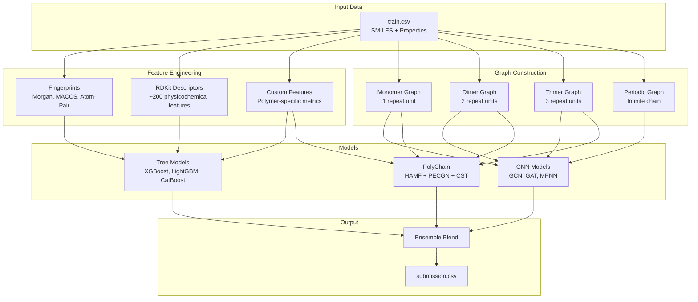

# Chapter 1: Project Overview

## Introduction

This chapter explains what PolyChain is, why it exists, and what it does at a high level.

---

## Core Concepts

### What is a Polymer?

A **polymer** is a large molecule made of repeating smaller units called **monomers**. Think of it like a chain of paper clips — each clip is a monomer, and the whole chain is the polymer.

Examples:
- **Polyethylene** (plastic bags) — repeat unit: `*CC*`
- **Polystyrene** (foam cups) — repeat unit: `*CC(c1ccccc1)*`
- **PET** (water bottles) — repeat unit: `*COC(=O)c1ccc(C(=O)O)cc1*`

### What is SMILES?

**SMILES** (Simplified Molecular Input Line Entry System) is a way to write chemical structures as text. For example:
- `*CCO*` represents a polymer with a repeating unit of 2 carbons and an oxygen
- The `*` symbols represent **connection points** — where one repeat unit connects to the next

### What Properties Does PolyChain Predict?

PolyChain predicts properties like:
- **Tg** (Glass Transition Temperature) — the temperature where plastic goes from hard to rubbery
- **Tm** (Melting Temperature) — the temperature where plastic melts
- **Density** — how heavy the plastic is for its size
- **Td** (Decomposition Temperature) — where plastic starts to break down

---

## The Big Picture



---

## What Makes PolyChain Special?

PolyChain introduces **two novel innovations**:

### 1. HAMF (Hierarchy-Aware Multi-Scale Fusion)

Instead of looking at just one repeat unit, PolyChain looks at:
- **Monomer** (1 repeat unit)
- **Dimer** (2 repeat units joined)
- **Trimer** (3 repeat units joined)

Then it **fuses** information from all three scales using attention (a smart way to combine information).

**Analogy**: Instead of reading just one sentence of a story, you read the sentence, the paragraph, and the page — then combine all the context.

### 2. PECGN (Periodic Equivariant Chain-Growth Network)

Polymers repeat infinitely. PECGN handles this by:
- Learning how the chain "wraps around" at the ends
- Making predictions **invariant** to where you "cut" the chain (shifting the starting point doesn't change the result)

**Analogy**: A necklace looks the same no matter which bead you start counting from.

---

## The 11 Models

PolyChain trains **11 different models** and combines their predictions:

| Model Type | Category | Description |
|------------|----------|-------------|
| `ridge` | Linear | Simple linear regression with regularization |
| `xgb` | Tree | XGBoost gradient boosting |
| `lgb` | Tree | LightGBM gradient boosting |
| `catboost` | Tree | CatBoost gradient boosting |
| `rf` | Tree | Random Forest |
| `mlp` | Neural Net | Multi-layer perceptron on fingerprints |
| `gcn` | GNN | Graph Convolutional Network |
| `gat` | GNN | Graph Attention Network |
| `mpnn` | GNN | Message Passing Neural Network |
| `graph_transformer` | GNN | Graph Transformer |
| `polychain` | Novel | **PolyChain** (the novel contribution) |

**Why so many?** Each model has different strengths. By combining them (ensembling), we get better predictions than any single model.

---

## Detailed Explanation

### The Pipeline

The project runs a **5-step pipeline**:

1. **Step 1 — CV Splits**: Divide training data into 5 folds for cross-validation
2. **Step 2 — Features**: Extract chemical features from SMILES strings
3. **Step 3 — Training**: Train all 11 models on each fold
4. **Step 4 — Ensemble**: Combine predictions from all models
5. **Step 5 — Reports**: Generate analysis reports (SHAP, error analysis, EDA)

### Competition Context

This project was built for a polymer property prediction competition. The goal is to predict properties like Tg, Tm, and density for polymers given their SMILES strings.

---

## Visual Diagram



---

## Examples

### Input Example
```python
smiles = "*CCO*"  # Polyethylene glycol repeat unit
property_to_predict = "Tg"  # Glass transition temperature
```

### Output Example
```python
predicted_Tg = 350.2  # Kelvin
```

---

## Common Mistakes

1. **Confusing SMILES with化学 formulas**: SMILES is a text representation, not a formula like H2O
2. **Thinking `*` means something is missing**: `*` represents connection points in the polymer chain, not missing atoms
3. **Assuming one model is enough**: The ensemble of 11 models is much more powerful than any single model

---

## Summary

- PolyChain predicts polymer properties from SMILES strings
- It uses 11 models, with a novel "PolyChain" architecture as the centerpiece
- The pipeline: data → features → training → ensemble → predictions
- Two key innovations: HAMF (multi-scale fusion) and PECGN (periodic equivariance)

---

## Key Takeaways

- Polymers are chain-like materials; SMILES describes their structure
- PolyChain predicts properties like Tg, Tm, and density
- The project combines 11 models via ensembling
- Two novel innovations make PolyChain unique: HAMF and PECGN
