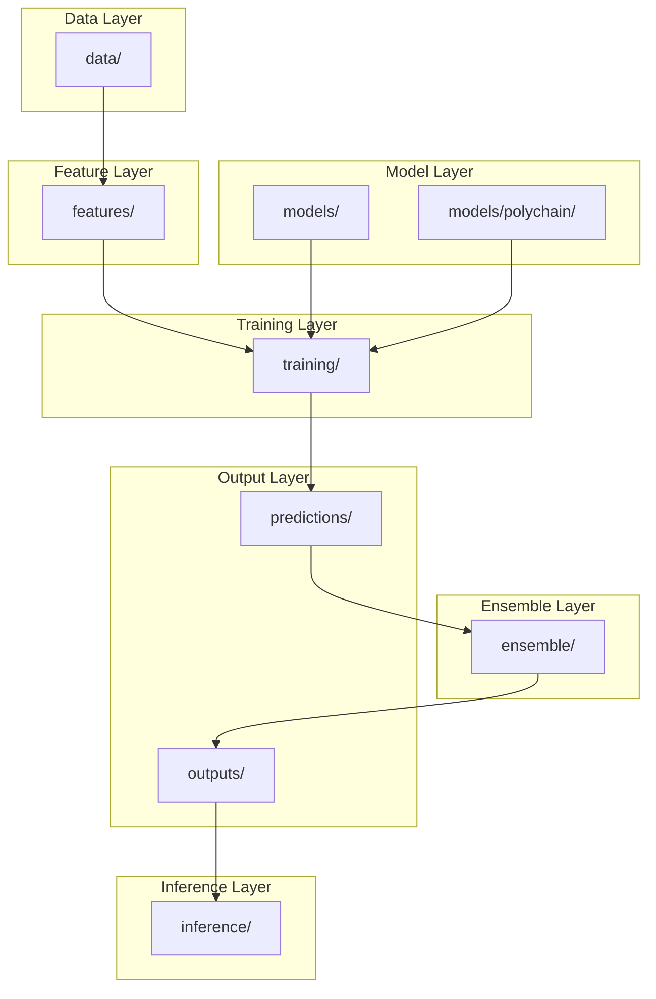

# Chapter 2: Folder Structure

## Introduction

This chapter explains every folder and file in the project, why it exists, and what would happen if it were removed.

---

## Core Concepts

### Project Root

The project root is `polymer_competition/` inside the repository. All commands should be run from this directory.

---

## Complete Directory Tree

```
polymer_competition/
├── config.yaml                    # Global configuration
├── generate_all.py                # Master pipeline script
├── requirements.txt               # Python dependencies
├── KAGGLE_COLAB_GUIDE.md          # Cloud deployment guide
│
├── data/                          # Raw data and splits
│   ├── train.csv                  # Training data (SMILES + properties)
│   ├── test.csv                   # Test data (SMILES only)
│   ├── splits.pkl                 # Cross-validation splits
│   ├── generate_splits.py         # Split generation script
│   ├── download_sample_data.py    # Download sample data for testing
│   └── README.md                  # Data format documentation
│
├── features/                      # Feature engineering
│   ├── __init__.py                # Package init
│   ├── fingerprints.py            # Morgan, MACCS, atom-pair fingerprints
│   ├── descriptors.py             # ~200 RDKit 2D descriptors
│   ├── custom_polymer.py          # Polymer-specific features
│   ├── graphs.py                  # Graph construction (monomer/dimer/trimer/periodic)
│   └── graph_utils.py             # Multi-scale graph helpers
│
├── models/                        # Model architectures
│   ├── __init__.py                # Package init
│   ├── baselines.py               # Linear/Ridge/Lasso models
│   ├── tree_models.py             # XGBoost, LightGBM, CatBoost, RF
│   ├── mlp.py                     # Fingerprint & Descriptor MLPs
│   ├── gnn.py                     # GCN, GAT, MPNN
│   ├── graph_transformer.py       # Graph Transformer
│   ├── chemberta.py               # ChemBERTa embedding extractor
│   ├── fusionnet.py               # Multimodal fusion network
│   └── polychain/                 # ★ PolyChain architecture
│       ├── __init__.py            # Exports PolyChain, compute_cst
│       ├── backbone.py            # GIN-S backbone with virtual node
│       ├── hamf.py                # Hierarchy-Aware Multi-Scale Fusion
│       ├── pecgn.py               # Periodic Equivariant Chain-Growth Network
│       ├── cst.py                 # Chain Statistics Token
│       ├── graph_builder.py       # Multi-scale graph builder
│       ├── polychain_model.py     # End-to-end PolyChain model
│       ├── configs/               # Model-specific configs
│       │   ├── base.yaml
│       │   ├── finetune.yaml
│       │   └── pretrain.yaml
│       └── pretraining/           # Self-supervised pretraining
│           ├── __init__.py
│           ├── asterisk_mask.py   # Asterisk-mask reconstruction
│           └── sub_smiles_mask.py # BERT-style SMILES masking
│
├── training/                      # Training logic
│   ├── __init__.py                # Package init
│   ├── train.py                   # Main training entry point
│   ├── train_utils.py             # Metrics, checkpointing, seeding
│   ├── hpo_search.py              # Optuna hyperparameter search
│   └── configs/                   # Training configs
│       ├── xgb.yaml
│       ├── lgb.yaml
│       ├── polychain_finetune.yaml
│       └── fusionnet.yaml
│
├── ensemble/                      # Model ensembling
│   ├── __init__.py                # Package init
│   ├── build_ensemble.py          # Blend predictions → submission.csv
│   └── weight_optimizer.py        # Weight optimization strategies
│
├── inference/                     # Prediction and demo
│   ├── __init__.py                # Package init
│   ├── predictor.py               # PolymerPredictor class
│   └── chat_interface.py          # Streamlit chat UI
│
├── demo/                          # Demo application
│   ├── app.py                     # Streamlit entry point
│   └── README.md                  # Demo documentation
│
├── tests/                         # Unit tests
│   ├── __init__.py
│   ├── test_polychain.py          # PolyChain forward + invariance tests
│   ├── test_graphs.py             # Graph construction smoke tests
│   └── test_features.py           # Feature extraction tests
│
├── notebooks/                     # Analysis scripts
│   ├── eda_report.py              # Automated EDA report generator
│   └── README.md                  # Planned notebooks
│
├── reports/                       # Generated reports
│   ├── generate_reports.py        # SHAP, error analysis, model summary
│   └── README.md                  # Report descriptions
│
├── docs/                          # Documentation
│   ├── README.md                  # Docs index
│   ├── architecture_overview.md   # Architecture diagram
│   └── polychain_whitepaper.md    # Full research proposal
│
├── outputs/                       # Generated outputs (gitignored)
│   ├── checkpoints/               # Model checkpoints
│   ├── logs/                      # Training logs
│   └── submissions/               # submission.csv
│
└── predictions/                   # OOF predictions (gitignored)
    └── *.pkl                      # Per-fold prediction files
```

---

## Detailed Folder Explanations

### `data/` — Raw Data and Splits

**Purpose**: Contains the raw competition data and scripts to process it.

| File | Purpose | What Happens if Removed |
|------|---------|------------------------|
| `train.csv` | Training data with SMILES and properties | **Pipeline fails** — no data to train on |
| `test.csv` | Test data for competition submission | No test predictions generated |
| `splits.pkl` | Pre-generated CV splits | Must regenerate before training |
| `generate_splits.py` | Creates CV splits | Cannot create new splits |
| `download_sample_data.py` | Downloads ESOL dataset for testing | No sample data for quick tests |

**Interactions**: Read by `training/train.py`, `features/build_features.py`, `ensemble/build_ensemble.py`

### `features/` — Feature Engineering

**Purpose**: Converts SMILES strings into numerical features that models can understand.

| File | Purpose | What Happens if Removed |
|------|---------|------------------------|
| `fingerprints.py` | Morgan, MACCS, atom-pair fingerprints | No fingerprint features for tree models |
| `descriptors.py` | ~200 RDKit 2D descriptors | No descriptor features |
| `custom_polymer.py` | Polymer-specific features (asterisks, rings, etc.) | No polymer-aware features |
| `graphs.py` | Builds monomer/dimer/trimer/periodic graphs | No graph data for GNNs |
| `graph_utils.py` | Multi-scale graph construction helpers | PolyChain cannot build graphs |

**Interactions**: Used by `training/train.py`, `models/polychain/`, `inference/predictor.py`

### `models/` — Model Architectures

**Purpose**: Defines all 11 model architectures.

| File | Purpose | What Happens if Removed |
|------|---------|------------------------|
| `baselines.py` | Linear/Ridge/Lasso wrappers | No linear baselines |
| `tree_models.py` | XGBoost, LightGBM, CatBoost, RF | No tree-based models |
| `mlp.py` | Fingerprint & Descriptor MLPs | No MLP models |
| `gnn.py` | GCN, GAT, MPNN | No GNN baselines |
| `graph_transformer.py` | Graph Transformer | No transformer baseline |
| `chemberta.py` | ChemBERTa extractor | No pretrained language model features |
| `fusionnet.py` | Multimodal fusion | No multimodal baseline |

**Interactions**: Imported by `training/train.py`, used by `inference/predictor.py`

### `models/polychain/` — ★ PolyChain Architecture

**Purpose**: The novel contribution — a hierarchical periodic transformer.

| File | Purpose | What Happens if Removed |
|------|---------|------------------------|
| `backbone.py` | GIN-S encoder with virtual node | No shared graph encoder |
| `hamf.py` | Multi-scale fusion via cross-attention | No scale fusion |
| `pecgn.py` | Learned periodic boundary operator | No periodic equivariance |
| `cst.py` | Chain Statistics Token computation | No chain statistics |
| `graph_builder.py` | Multi-scale graph construction | PolyChain cannot build graphs |
| `polychain_model.py` | End-to-end PolyChain model | **PolyChain cannot run** |
| `configs/` | Model hyperparameters | Uses default values |
| `pretraining/` | Self-supervised pretraining tasks | No pretraining available |

**Interactions**: Used by `training/train.py`, `inference/predictor.py`, `tests/test_polychain.py`

### `training/` — Training Logic

**Purpose**: Contains the main training loop, metrics, and utilities.

| File | Purpose | What Happens if Removed |
|------|---------|------------------------|
| `train.py` | Main training entry point | **Cannot train any model** |
| `train_utils.py` | Metrics, checkpointing, seeding | No reproducibility or metrics |
| `hpo_search.py` | Optuna hyperparameter search | No automated HPO |
| `configs/` | Per-model training configs | Uses default hyperparameters |

**Interactions**: Called by `generate_all.py`, imports from `models/`, `features/`

### `ensemble/` — Model Ensembling

**Purpose**: Combines predictions from all models into a final submission.

| File | Purpose | What Happens if Removed |
|------|---------|------------------------|
| `build_ensemble.py` | Blends OOF predictions | **No submission.csv generated** |
| `weight_optimizer.py` | Weight optimization strategies | No smart weight selection |

**Interactions**: Called by `generate_all.py`, reads from `predictions/`, writes to `outputs/submissions/`

### `inference/` — Prediction and Demo

**Purpose**: Provides prediction capabilities and a web interface.

| File | Purpose | What Happens if Removed |
|------|---------|------------------------|
| `predictor.py` | PolymerPredictor class | Cannot make predictions on new data |
| `chat_interface.py` | Streamlit chat UI | No web interface |

**Interactions**: Uses `models/polychain/`, `features/`, reads checkpoints from `outputs/checkpoints/`

### `tests/` — Unit Tests

**Purpose**: Verifies that components work correctly.

| File | Purpose | What Happens if Removed |
|------|---------|------------------------|
| `test_polychain.py` | PolyChain forward + invariance tests | No regression tests for PolyChain |
| `test_graphs.py` | Graph construction tests | No graph validation |
| `test_features.py` | Feature extraction tests | No feature validation |

**Interactions**: Run via `pytest`, imports from `features/`, `models/polychain/`

### `notebooks/` — Analysis Scripts

**Purpose**: Automated EDA and analysis.

| File | Purpose | What Happens if Removed |
|------|---------|------------------------|
| `eda_report.py` | Automated EDA report | No exploratory data analysis |

**Interactions**: Called by `generate_all.py` (step 5), uses `features/`

### `reports/` — Generated Reports

**Purpose**: Generates model evaluation reports.

| File | Purpose | What Happens if Removed |
|------|---------|------------------------|
| `generate_reports.py` | SHAP, error analysis, model summary | No evaluation reports |

**Interactions**: Called by `generate_all.py` (step 5), reads from `predictions/`

### `docs/` — Documentation

**Purpose**: Project documentation and whitepaper.

| File | Purpose | What Happens if Removed |
|------|---------|------------------------|
| `architecture_overview.md` | Architecture diagram | No visual architecture reference |
| `polychain_whitepaper.md` | Full research proposal | No detailed technical documentation |

### `outputs/` — Generated Outputs (Gitignored)

**Purpose**: Stores generated files (checkpoints, logs, submissions).

| Folder | Purpose | What Happens if Removed |
|--------|---------|------------------------|
| `checkpoints/` | Saved model weights | Must retrain models |
| `logs/` | Training logs | No training history |
| `submissions/` | Final submission.csv | No competition submission |

### `predictions/` — OOF Predictions (Gitignored)

**Purpose**: Stores out-of-fold predictions from each model.

| File Pattern | Purpose |
|--------------|---------|
| `{person}_{model}_fold{n}.pkl` | Per-fold OOF predictions |

---

## Visual Diagram



---

## Examples

### Running a specific module
```bash
# Run feature generation as a module
python -m features.build_features

# Run training as a module
python -m training.train --model_type polychain --fold 0

# Run ensemble as a module
python -m ensemble.build_ensemble
```

---

## Common Mistakes

1. **Running from the wrong directory**: Always run from `polymer_competition/`
2. **Missing `__init__.py` files**: These make Python treat folders as packages
3. **Confusing `outputs/` and `predictions/`**: `outputs/` has checkpoints and submissions; `predictions/` has OOF prediction files

---

## Summary

- The project is organized into logical layers: data → features → models → training → ensemble → inference
- Each folder has a specific responsibility
- `models/polychain/` contains the novel PolyChain architecture
- `outputs/` and `predictions/` are gitignored and generated at runtime

---

## Key Takeaways

- `data/` holds raw data and splits
- `features/` converts SMILES to numerical features
- `models/` defines 11 model architectures
- `training/` contains the training loop
- `ensemble/` combines model predictions
- `inference/` provides prediction and demo capabilities
- `outputs/` and `predictions/` are generated, not stored in git
