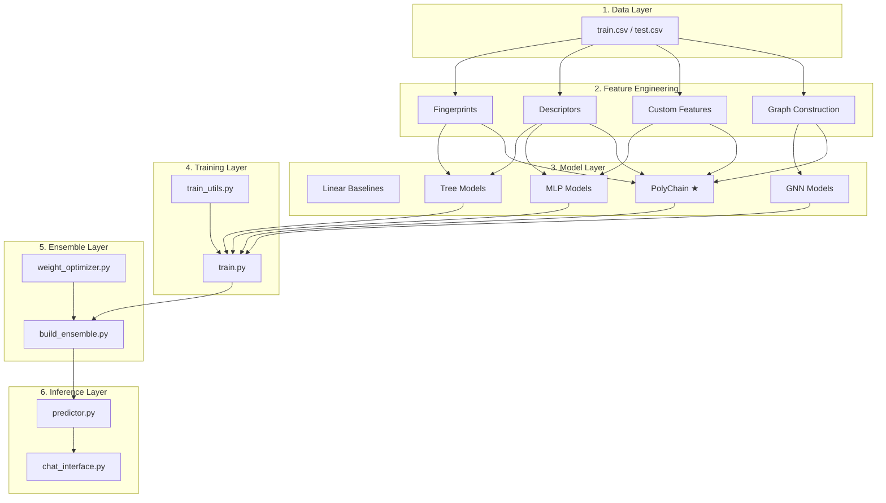
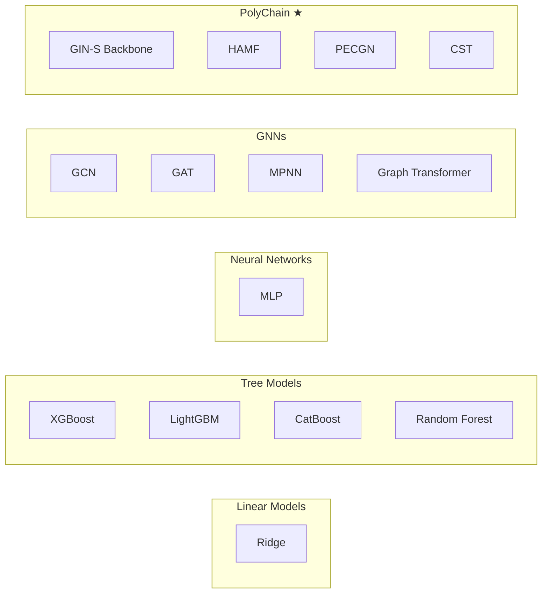
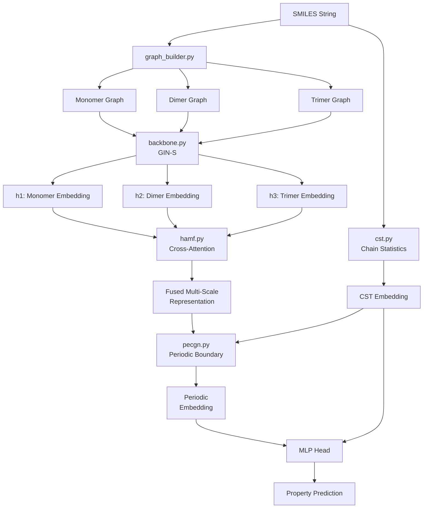

# Chapter 3: Architecture

## Introduction

This chapter explains how all components in PolyChain connect and communicate. Think of architecture as the "blueprint" of a building — it shows how rooms (components) are connected by hallways (data flow).

---

## Core Concepts

### What is Software Architecture?

Architecture describes:
- **Components**: The major pieces of the system
- **Connections**: How they talk to each other
- **Data flow**: How information moves through the system

### Why Architecture Matters

Without understanding architecture, you cannot:
- Know where to make changes
- Understand why code is organized a certain way
- Debug issues that span multiple components

---

## High-Level Architecture



---

## Detailed Architecture

### Layer 1: Data Layer

**Input**: CSV files with SMILES strings and property values

**Files involved**:
- `data/train.csv` — training data
- `data/test.csv` — test data
- `data/splits.pkl` — cross-validation splits

**Data format**:
```csv
id,SMILES,property
0,*CCO*,350.2
1,*c1ccc(*)cc1*,420.5
```

### Layer 2: Feature Engineering

**Purpose**: Convert text (SMILES) into numbers (features)

**Three types of features**:

1. **Fingerprints** (`features/fingerprints.py`)
   - Morgan fingerprints (2048 bits)
   - MACCS keys (167 bits)
   - Atom-pair fingerprints (2048 bits)
   - Topological torsion fingerprints (2048 bits)

2. **Descriptors** (`features/descriptors.py`)
   - ~200 RDKit 2D molecular descriptors
   - Examples: molecular weight, TPSA, logP

3. **Custom Polymer Features** (`features/custom_polymer.py`)
   - Number of connection points (`*`)
   - Repeat unit length
   - Branching indicator
   - Aromatic carbon fraction
   - Ring statistics
   - End-group counts

**Graph Construction** (`features/graphs.py`):
- Monomer graph: 1 repeat unit
- Dimer graph: 2 repeat units
- Trimer graph: 3 repeat units
- Periodic graph: closed ring

### Layer 3: Model Layer

**11 models** organized by type:



### Layer 4: Training Layer

**Entry point**: `training/train.py`

**What it does**:
1. Loads features and splits
2. Creates model based on `model_type`
3. Trains on training fold
4. Validates on validation fold
5. Saves OOF predictions to `.pkl` file

**Key function**: `build_model()` — factory that creates any of the 11 model types

### Layer 5: Ensemble Layer

**Entry point**: `ensemble/build_ensemble.py`

**What it does**:
1. Loads all OOF predictions from `predictions/`
2. Builds an (n_samples × n_models) matrix
3. Optimizes weights using one of three strategies:
   - `inverse_rmse`: Weight proportional to 1/RMSE
   - `nelder_mead`: Optimization to minimize RMSE
   - `stacking`: Ridge regression meta-learner
4. Generates `submission.csv`

### Layer 6: Inference Layer

**Entry point**: `inference/predictor.py`

**What it does**:
1. Loads a trained PolyChain checkpoint
2. Accepts new SMILES strings
3. Builds multi-scale graphs
4. Computes CST features
5. Returns property predictions

**Web interface**: `inference/chat_interface.py` (Streamlit app)

---

## PolyChain Architecture (Deep Dive)

### The Forward Pass

```python
# Simplified PolyChain forward pass
def forward(batch_dict):
    # 1. Per-scale encoding
    h1 = backbone(monomer_graph)    # (B, d)
    h2 = backbone(dimer_graph)      # (B, d)
    h3 = backbone(trimer_graph)     # (B, d)
    
    # 2. HAMF fusion
    fused = HAMF([h1, h2, h3])     # (B, 3d)
    
    # 3. CST embedding
    cst_emb = CST_normalizer(cst)   # (B, d)
    
    # 4. PECGN periodic boundary
    periodic = PECGN(fused, cst_emb)  # (B, 3d)
    
    # 5. Prediction head
    combined = concat(periodic, cst_emb)  # (B, 4d)
    prediction = MLP(combined)            # (B, 1)
    
    return prediction
```

### Component Interactions



---

## Design Patterns

### 1. Factory Pattern

`training/train.py::build_model()` uses the factory pattern to create models:

```python
def build_model(model_type, cfg, in_dim, edge_dim):
    if model_type == "ridge":
        return get_linear_model("ridge"), False
    if model_type == "xgb":
        return get_tree_model("xgb", **cfg), False
    if model_type == "polychain":
        return PolyChain(in_atom_dim=in_dim, ...), True
    # ... etc
```

**Why**: Allows adding new models without changing the training loop.

### 2. Strategy Pattern

`ensemble/weight_optimizer.py` uses the strategy pattern for weight optimization:

```python
def get_weights(strategy, oof_preds, y_true):
    if strategy == "inverse_rmse":
        return inverse_rmse_weights(oof_preds, y_true)
    if strategy == "nelder_mead":
        return nelder_mead_weights(oof_preds, y_true)
    if strategy == "stacking":
        return stacking_ridge(oof_preds, y_true)
```

**Why**: Easy to add new ensemble strategies.

### 3. Pipeline Pattern

`generate_all.py` orchestrates a 5-step pipeline where each step feeds into the next.

**Why**: Clear separation of concerns, easy to run partial pipelines.

---

## Examples

### Adding a New Model

To add a new model, you need to:

1. Create the model class in `models/`
2. Add it to `build_model()` in `training/train.py`
3. Add it to `ALL_MODEL_TYPES` in `generate_all.py`
4. Add a config in `training/configs/` (optional)

### Adding a New Feature

To add a new feature:

1. Add the computation in `features/custom_polymer.py`
2. Add it to `compute_all_custom_features()`
3. It will automatically be included in the feature matrix

---

## Common Mistakes

1. **Confusing model architecture with training logic**: `models/` defines what the model IS; `training/` defines how it LEARNS
2. **Modifying the wrong layer**: If you change feature engineering, you affect all models. If you change a model, you only affect that model.
3. **Forgetting to update configs**: When you change model hyperparameters, update the corresponding YAML config

---

## Summary

- PolyChain has 6 layers: Data → Features → Models → Training → Ensemble → Inference
- Each layer has clear responsibilities
- PolyChain (the novel model) has 4 sub-components: backbone, HAMF, PECGN, CST
- Design patterns (factory, strategy, pipeline) make the code extensible

---

## Key Takeaways

- The architecture follows a clear layered design
- Data flows from left to right: SMILES → features → models → predictions
- PolyChain's 4 sub-components work together: backbone encodes, HAMF fuses, PECGN adds periodicity, CST adds chain statistics
- Design patterns make the codebase extensible
