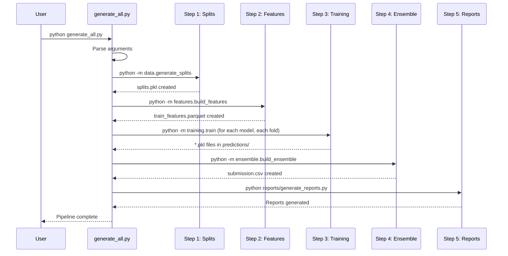
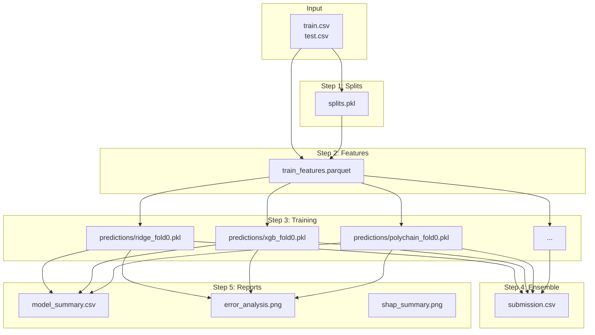

# Chapter 4: Execution Flow

## Introduction

This chapter explains what happens step-by-step when you run the project. Think of it as a "movie script" — scene by scene, from start to finish.

---

## Core Concepts

### What is Execution Flow?

Execution flow describes the order in which code runs, what functions are called, and how data moves through the system.

---

## Complete Execution Flow

### When You Run `python generate_all.py`



---

## Step-by-Step Breakdown

### Step 0: Initialization

**What happens**:
1. `generate_all.py` is executed
2. Command-line arguments are parsed
3. Configuration is loaded from `config.yaml`

**Code path**:
```python
# generate_all.py:main()
parser = argparse.ArgumentParser()
parser.add_argument("--config", default="config.yaml")
parser.add_argument("--steps", default="1,2,3,4,5")
parser.add_argument("--models", default=None)
args = parser.parse_args()
```

**Output**: Configuration loaded, arguments parsed

---

### Step 1: Generate CV Splits

**Command**: `python -m data.generate_splits --config config.yaml`

**What happens**:
1. Load `data/train.csv`
2. Compute SMILES scaffolds for grouping
3. Create 5-fold GroupKFold splits
4. Save splits to `data/splits.pkl`

**Code path**:
```python
# data/generate_splits.py:generate_splits()
train = pd.read_csv(train_path)
scaffolds = train["SMILES"].apply(smiles_scaffold).values
gkf = GroupKFold(n_splits=n_folds)
for fold, (tr_idx, va_idx) in enumerate(gkf.split(train, y, groups=scaffolds)):
    splits[fold] = {"train": tr_idx.tolist(), "val": va_idx.tolist()}
```

**Output**: `data/splits.pkl` containing 5 folds

**Key function**: `smiles_scaffold()` — creates a coarse grouping string from SMILES

---

### Step 2: Build Feature Matrix

**Command**: `python -m features.build_features --config config.yaml`

**What happens**:
1. Load `data/train.csv` and `data/test.csv`
2. Compute fingerprints (Morgan, MACCS, atom-pair, torsion)
3. Compute ~200 RDKit 2D descriptors
4. Compute custom polymer features
5. Combine all features into a single matrix
6. Save to `data/processed/train_features.parquet`

**Code path** (simplified):
```python
# features/build_features.py
train = pd.read_csv("data/train.csv")
fps = all_fingerprints(train["SMILES"].tolist())
descs = compute_descriptors(train["SMILES"].tolist())
custom = compute_all_custom_features(train["SMILES"].tolist())
features = pd.concat([fps, descs, custom], axis=1)
features.to_parquet("data/processed/train_features.parquet")
```

**Output**: `data/processed/train_features.parquet`

---

### Step 3: Train Models

**Command**: `python -m training.train --model_type {model} --fold {n} --config config.yaml`

**What happens** (for each model type, for each fold):

#### For Tree Models (XGBoost, LightGBM, CatBoost, RF):
1. Load feature matrix
2. Split into train/val using `splits.pkl`
3. Create model via `build_model()`
4. Train with `model.fit(X_train, y_train)`
5. Predict on validation set
6. Save OOF predictions to `predictions/{person}_{model}_fold{n}.pkl`

#### For GNN Models (GCN, GAT, MPNN, Graph Transformer):
1. Load SMILES and targets
2. Build graphs using `smiles_to_graph()`
3. Create DataLoader
4. Create model via `build_model()`
5. Train with AdamW optimizer + cosine scheduler
6. Early stopping on validation RMSE
7. Save OOF predictions

#### For PolyChain:
1. Load SMILES and targets
2. Build multi-scale graphs using `build_multiscale()`
3. Compute CST features
4. Create DataLoader with custom collate function
5. Create PolyChain model
6. Calibrate CST normalizer
7. Train with AdamW + cosine scheduler
8. Early stopping on validation RMSE
9. Save OOF predictions

**Code path** (PolyChain example):
```python
# training/train.py:main()
# 1. Load data
train = pd.read_parquet("data/processed/train_features.parquet")
splits = pickle.load(open("data/splits.pkl", "rb"))

# 2. Build multi-scale graphs
samples = [build_multiscale(s, y=y) for s, y in zip(smiles, targets)]

# 3. Compute CST
cst = compute_cst_batch(smiles)

# 4. Create DataLoader
train_loader = DataLoader(samples, batch_size=32, collate_fn=collate)

# 5. Build model
model = PolyChain(in_atom_dim=60, in_edge_dim=6, hidden_dim=256)

# 6. Train
for epoch in range(200):
    for batch in train_loader:
        pred = model(batch)
        loss = criterion(pred, batch["y"])
        loss.backward()
        optimizer.step()
    
    # Validate
    val_rmse = evaluate(model, val_loader)
    if val_rmse < best_val_rmse:
        save_checkpoint(model)
```

**Output**: `predictions/{person}_{model}_fold{n}.pkl` files

---

### Step 4: Build Ensemble

**Command**: `python -m ensemble.build_ensemble --config config.yaml`

**What happens**:
1. Load all OOF prediction `.pkl` files
2. Build OOF matrix: (n_samples × n_models)
3. Compute optimal weights using the chosen strategy
4. Blend predictions: `blended = oof_matrix @ weights`
5. Generate `submission.csv`

**Code path**:
```python
# ensemble/build_ensemble.py:main()
# 1. Load predictions
df = load_predictions(pred_dir)

# 2. Build OOF matrix
oof, y, model_names = build_oof_matrix(df)

# 3. Compute weights
w = get_weights("inverse_rmse", oof, y)

# 4. Blend
blended = oof @ w

# 5. Save submission
submission = pd.DataFrame({"id": test_ids, "property": test_blend})
submission.to_csv("outputs/submissions/submission.csv")
```

**Output**: `outputs/submissions/submission.csv`

---

### Step 5: Generate Reports

**Command**: `python reports/generate_reports.py --config config.yaml`

**What happens**:
1. Load all OOF predictions
2. Generate model summary CSV
3. Generate error analysis plots
4. Generate SHAP feature importance
5. Run automated EDA

**Output**:
- `reports/model_summary.csv`
- `reports/error_analysis.png`
- `reports/shap_summary.png`
- `reports/eda_target_distribution.png`

---

## Data Flow Diagram



---

## Running Specific Steps

You can run only specific steps:

```bash
# Run only steps 1 and 2 (splits + features)
python generate_all.py --steps 1,2

# Run only step 3 for specific models
python generate_all.py --steps 3 --models xgb,lgb,polychain

# Run only steps 4 and 5 (ensemble + reports)
python generate_all.py --steps 4,5
```

---

## Examples

### Example: Training a Single Model

```bash
# Train XGBoost on fold 0
python -m training.train --model_type xgb --fold 0 --person myname

# Train PolyChain on fold 0
python -m training.train --model_type polychain --fold 0 --person myname
```

### Example: Making a Prediction

```python
from inference.predictor import PolymerPredictor

# Load trained model
pred = PolymerPredictor("outputs/checkpoints/polychain_best.pt")

# Predict on new SMILES
result = pred.predict(["*CCO*", "*c1ccc(*)cc1*"])
print(result)  # [350.2, 420.5]
```

---

## Common Mistakes

1. **Running from wrong directory**: Always run from `polymer_competition/`
2. **Skipping steps**: Step 2 (features) must run before Step 3 (training)
3. **Wrong model type name**: Use exact names like `xgb`, `lgb`, `polychain`
4. **Missing data files**: Ensure `train.csv` and `test.csv` exist in `data/`

---

## Summary

- The pipeline runs 5 sequential steps
- Each step produces output files consumed by the next step
- Steps can be run independently with `--steps` flag
- The training step is the most complex, with different code paths for tree models, GNNs, and PolyChain

---

## Key Takeaways

- `generate_all.py` orchestrates the entire pipeline
- Step 1: Create CV splits → `splits.pkl`
- Step 2: Extract features → `train_features.parquet`
- Step 3: Train models → `predictions/*.pkl`
- Step 4: Ensemble → `submission.csv`
- Step 5: Reports → `reports/*.png` and `reports/*.csv`
- Steps can be run independently
