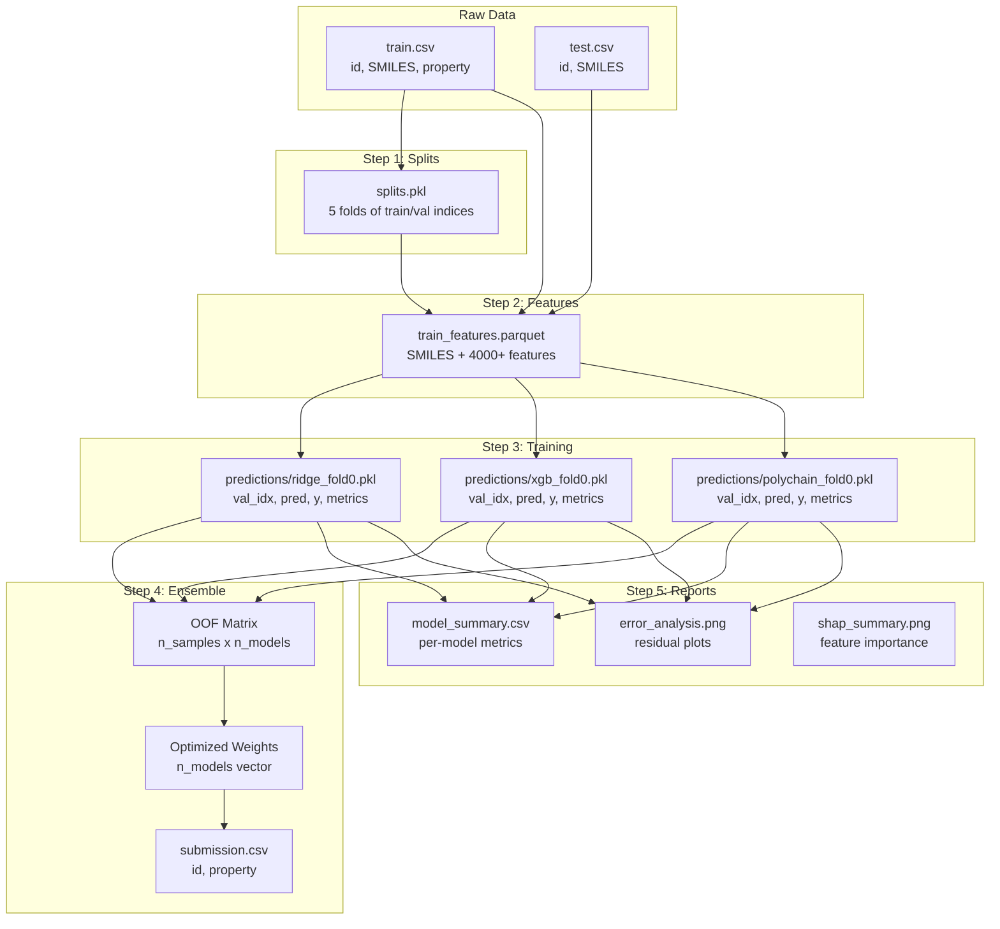
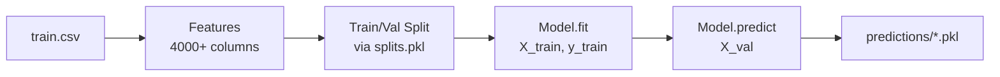
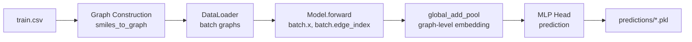

# Chapter 8: Database and Data Flow

## Introduction

This chapter explains how data moves through the PolyChain system, from raw CSV files to final predictions. Think of it as a "data river" — data flows from source to destination, being transformed along the way.

---

## Core Concepts

### What is Data Flow?

Data flow describes:
- **Sources**: Where data comes from
- **Transformations**: How data is modified
- **Destinations**: Where data ends up
- **Formats**: How data is structured at each step

---

## Complete Data Flow



---

## Data Formats

### Input Data

#### `data/train.csv`
```csv
id,SMILES,property
0,*CCO*,350.2
1,*c1ccc(*)cc1*,420.5
2,*CC(c1ccccc1)*,380.1
```

**Columns**:
- `id`: Unique identifier
- `smiles`: Polymer SMILES string with `*` connection points
- `property`: Target value (e.g., Tg, Tm, density)

#### `data/test.csv`
```csv
id,SMILES
0,*CC(C)C*
1,*c1ccc(N)cc1*
```

**Note**: No `property` column — that's what we're predicting!

---

### Intermediate Data

#### `data/splits.pkl`

**Format**: Python pickle file containing a dictionary

```python
{
    0: {"train": [0, 1, 2, 3, ...], "val": [4, 5, 6, 7, ...]},
    1: {"train": [0, 1, 2, 5, ...], "val": [3, 4, 7, 8, ...]},
    2: {"train": [0, 1, 3, 4, ...], "val": [2, 5, 6, 8, ...]},
    3: {"train": [0, 2, 3, 4, ...], "val": [1, 5, 7, 8, ...]},
    4: {"train": [1, 2, 3, 4, ...], "val": [0, 5, 6, 7, ...]}
}
```

**Structure**:
- Keys: fold numbers (0-4)
- Values: dictionaries with `train` and `val` lists of indices

---

#### `data/processed/train_features.parquet`

**Format**: Parquet columnar storage (efficient for large datasets)

**Columns**:
- `SMILES`: Original SMILES string
- `id`: Original ID
- `property`: Target value
- `morgan_0`, `morgan_1`, ..., `morgan_2047`: Morgan fingerprint bits
- `maccs_0`, `maccs_1`, ..., `maccs_166`: MACCS keys
- `atom_pair_0`, ..., `atom_pair_2047`: Atom-pair fingerprints
- `torsion_0`, ..., `torsion_2047`: Topological torsion fingerprints
- `MW`, `LogP`, `TPSA`, ..., `fr_Ar_OH`: ~200 RDKit descriptors
- `n_asterisks`, `repeat_length`, `is_branched`, ..., `endgroup_aromatic_ring`: ~30 custom features

**Total columns**: ~4000+

---

### Output Data

#### `predictions/{person}_{model}_fold{n}.pkl`

**Format**: Python pickle file

```python
{
    "val_idx": [4, 5, 6, 7, ...],      # Validation indices
    "pred": [352.1, 418.3, ...],        # Model predictions
    "y": [350.2, 420.5, ...],           # Ground truth
    "metrics": {                         # Evaluation metrics
        "rmse": 38.5,
        "mae": 27.3,
        "r2": 0.90,
        "spearman": 0.95
    },
    "model_type": "xgb",                # Model type
    "fold": 0,                          # Fold number
    "person": "team"                    # Team member name
}
```

---

#### `outputs/submissions/submission.csv`

**Format**: CSV file

```csv
id,property
0,352.1
1,418.3
2,385.7
```

**Columns**:
- `id`: Test sample ID
- `property`: Predicted property value

---

#### `reports/model_summary.csv`

**Format**: CSV file

```csv
model,rmse,mae,r2,n_folds,weight
polychain,32.1,22.5,0.93,5,0.30
xgb,38.5,27.3,0.90,5,0.15
lgb,39.2,28.1,0.89,5,0.12
catboost,40.1,29.5,0.88,5,0.10
ridge,45.2,32.1,0.85,5,0.05
BLEND,28.5,19.8,0.95,5,1.00
```

---

## Data Transformations

### Transformation 1: SMILES → Fingerprint

**Input**: SMILES string `"*CCO*"`

**Process**:
```python
from rdkit import Chem
from rdkit.Chem import AllChem

mol = Chem.MolFromSmiles("*CCO*")
fp = AllChem.GetMorganFingerprintAsBitVect(mol, radius=2, nBits=2048)
```

**Output**: 2048-bit vector `[0, 1, 0, 1, ..., 0]`

---

### Transformation 2: SMILES → Graph

**Input**: SMILES string `"*CCO*"`

**Process**:
```python
from features.graphs import smiles_to_graph

graph = smiles_to_graph("*CCO*")
# Returns: Data(x=[4, 60], edge_index=[2, 6], edge_attr=[6, 6])
```

**Output**: PyTorch Geometric Data object
- `x`: Atom features, shape `(n_atoms, 60)`
- `edge_index`: Edge connectivity, shape `(2, n_edges)`
- `edge_attr`: Edge features, shape `(n_edges, 6)`

---

### Transformation 3: SMILES → Multi-Scale Graphs

**Input**: SMILES string `"*CCO*"`

**Process**:
```python
from features.graph_utils import build_multiscale

sample = build_multiscale("*CCO*", y=350.2)
# Returns: MultiScaleSample with monomer, dimer, trimer, periodic
```

**Output**: 4 graphs
- Monomer: 1 repeat unit
- Dimer: 2 repeat units
- Trimer: 3 repeat units
- Periodic: Closed ring

---

### Transformation 4: SMILES → CST

**Input**: SMILES string `"*CCO*"`

**Process**:
```python
from models.polychain.cst import compute_cst

cst = compute_cst("*CCO*")
# Returns: np.ndarray of shape (33,)
```

**Output**: 33-dimensional vector containing:
- n_asterisks, repeat_length, is_branched, n_monomers_copolymer
- aromatic_c_frac, sp3_c_frac, rotatable_bonds, has_heteroatom_backbone
- mol_weight_monomer, ring_count, aromatic_rings, ...
- endgroup_OH, endgroup_COOH, endgroup_NH2, ...

---

### Transformation 5: Features → Prediction

**Input**: Feature matrix `(n_samples, 4000+)`

**Process**:
```python
from models.tree_models import get_tree_model

model = get_tree_model("xgb", n_estimators=2000)
model.fit(X_train, y_train)
predictions = model.predict(X_val)
```

**Output**: Prediction vector `(n_samples,)`

---

### Transformation 6: OOF Predictions → Ensemble

**Input**: Multiple OOF prediction files

**Process**:
```python
# Load all predictions
oof_matrix = np.column_stack([pred1, pred2, pred3, ...])  # (n_samples, n_models)

# Compute weights
weights = inverse_rmse_weights(oof_matrix, y_true)

# Blend
final_predictions = oof_matrix @ weights
```

**Output**: Final prediction vector `(n_samples,)`

---

## Data Flow by Component

### Tree Models (XGBoost, LightGBM, CatBoost, RF)



**Data shapes**:
- Input: `(n_train, 4000+)` features
- Training: `model.fit(X_train, y_train)`
- Output: `(n_val,)` predictions

---

### GNN Models (GCN, GAT, MPNN, Graph Transformer)



**Data shapes**:
- Input: PyG Data objects
- Batched: `(total_atoms, 60)` features
- Output: `(batch_size,)` predictions

---

### PolyChain

```mermaid
graph LR
    CSV[train.csv] --> MSG[Multi-Scale Graphs<br/>build_multiscale]
    CSV[train.csv] --> CST_RAW[CST Features<br/>compute_cst]
    MSG --> BATCH[Collate<br/>collate_multiscale]
    CST_RAW --> CST_TENSOR[CST Tensor<br/>(B, 33)]
    BATCH --> BB[Backbone<br/>GIN-S per scale]
    CST_TENSOR --> CST_NORM[CST Normalizer<br/>z-score + proj]
    BB --> SCALE_EMB[Scale Embeddings<br/>h1, h2, h3]
    SCALE_EMB --> HAMF[HAMF<br/>cross-attention]
    HAMF --> FUSED[Fused<br/>(B, 3d)]
    CST_NORM --> CST_EMB[CST Embedding<br/>(B, d)]
    FUSED --> PECGN[PECGN<br/>periodic boundary]
    CST_EMB --> PECGN
    PECGN --> HEAD[MLP Head<br/>prediction]
    CST_EMB --> HEAD
    HEAD --> PKL[predictions/*.pkl]
```

**Data shapes**:
- Monomer: `(B, n_atoms_mono, 60)`
- Dimer: `(B, n_atoms_di, 60)`
- Trimer: `(B, n_atoms_tri, 60)`
- CST: `(B, 33)`
- After backbone: `(B, d)` per scale
- After HAMF: `(B, 3d)`
- After PECGN: `(B, 3d)`
- Final: `(B,)` predictions

---

## Examples

### Example: Tracing Data Through the Pipeline

```python
import pandas as pd
import pickle
import numpy as np

# 1. Load raw data
train = pd.read_csv("data/train.csv")
print(f"Raw data: {train.shape}")  # (1000, 3)

# 2. Load splits
with open("data/splits.pkl", "rb") as f:
    splits = pickle.load(f)
print(f"Folds: {len(splits)}")  # 5

# 3. Load features
features = pd.read_parquet("data/processed/train_features.parquet")
print(f"Features: {features.shape}")  # (1000, 4000+)

# 4. Load predictions
with open("predictions/team_xgb_fold0.pkl", "rb") as f:
    pred_data = pickle.load(f)
print(f"Predictions: {len(pred_data['pred'])}")  # 200 (validation size)

# 5. Load submission
submission = pd.read_csv("outputs/submissions/submission.csv")
print(f"Submission: {submission.shape}")  # (500, 2)
```

### Example: Verifying Data Integrity

```python
import pandas as pd
import numpy as np

# Check for missing values
train = pd.read_csv("data/train.csv")
print(f"Missing SMILES: {train['SMILES'].isna().sum()}")
print(f"Missing property: {train['property'].isna().sum()}")

# Check for duplicates
n_duplicates = train.duplicated(subset=["SMILES"]).sum()
print(f"Duplicate SMILES: {n_duplicates}")

# Check SMILES format
has_asterisk = train["SMILES"].str.contains("\\*").all()
print(f"All SMILES have *: {has_asterisk}")

# Check feature matrix
features = pd.read_parquet("data/processed/train_features.parquet")
print(f"Feature columns: {len(features.columns)}")
print(f"NaN in features: {features.isna().sum().sum()}")
```

---

## Common Mistakes

1. **Wrong file paths**: Ensure paths in `config.yaml` match actual file locations
2. **Missing data files**: `train.csv` and `test.csv` must exist before running pipeline
3. **Corrupted pickle files**: If `.pkl` files are corrupted, regenerate them
4. **Feature mismatch**: Training and test features must have same columns

---

## Summary

- Data flows from CSV → features → models → predictions → submission
- Each step transforms data into a new format
- Intermediate files (`.pkl`, `.parquet`) store transformed data
- Final output is `submission.csv` with predictions

---

## Key Takeaways

- Raw data: CSV with SMILES and properties
- Features: ~4000+ columns (fingerprints + descriptors + custom)
- Predictions: Per-fold `.pkl` files
- Submission: CSV with id and predicted property
- Reports: CSV and PNG files with evaluation metrics
- Data flows left to right, being transformed at each step
