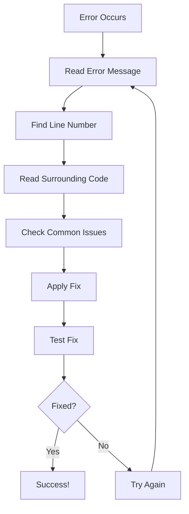

# Chapter 10: Debugging Guide

## Introduction

This chapter explains how to find and fix common issues in the PolyChain project. Debugging is like being a detective — you look for clues (error messages) to find the culprit (the bug).

---

## Core Concepts

### What is Debugging?

Debugging is the process of:
1. **Identifying** the problem (what's going wrong?)
2. **Locating** the source (where is it going wrong?)
3. **Fixing** the issue (how do I make it right?)
4. **Verifying** the fix (did it work?)

### Common Error Types

| Error Type | Example | Cause |
|------------|---------|-------|
| SyntaxError | `IndentationError` | Missing indentation |
| ImportError | `ModuleNotFoundError` | Missing package |
| FileNotFoundError | `No such file or directory` | Wrong path |
| RuntimeError | `CUDA out of memory` | GPU memory full |
| ValueError | `Unknown model_type` | Invalid argument |

---

## Debugging Workflow



---

## Common Issues and Solutions

### Issue 1: Import Errors

**Error**:
```
ModuleNotFoundError: No module named 'rdkit'
```

**Cause**: RDKit not installed

**Solution**:
```bash
pip install rdkit-pypi
```

---

**Error**:
```
ModuleNotFoundError: No module named 'torch_geometric'
```

**Cause**: PyTorch Geometric not installed

**Solution**:
```bash
pip install torch-geometric
```

---

**Error**:
```
ModuleNotFoundError: No module named 'xgboost'
```

**Cause**: XGBoost not installed

**Solution**:
```bash
pip install xgboost
```

---

### Issue 2: File Not Found Errors

**Error**:
```
FileNotFoundError: data/train.csv
```

**Cause**: Data files not in correct location

**Solution**:
```bash
# Check if files exist
ls data/

# If missing, download sample data
python data/download_sample_data.py

# Or place your files manually in data/
```

---

**Error**:
```
FileNotFoundError: outputs/checkpoints/polychain_best.pt
```

**Cause**: Model not trained yet

**Solution**:
```bash
# Train the model first
python -m training.train --model_type polychain --fold 0
```

---

**Error**:
```
FileNotFoundError: config.yaml
```

**Cause**: Running from wrong directory

**Solution**:
```bash
# Always run from polymer_competition/
cd polymer_competition
python generate_all.py
```

---

### Issue 3: CUDA/GPU Errors

**Error**:
```
RuntimeError: CUDA out of memory
```

**Cause**: GPU doesn't have enough memory

**Solution**:
```bash
# Option 1: Reduce batch size in config
# Edit training/configs/polychain_finetune.yaml
# Change batch_size: 32 to batch_size: 16

# Option 2: Use CPU
# Edit config.yaml
# Change device.use_cuda: true to device.use_cuda: false

# Option 3: Clear GPU cache
python -c "import torch; torch.cuda.empty_cache()"
```

---

**Error**:
```
RuntimeError: CUDA error: no kernel image is available for execution on the device
```

**Cause**: CUDA version mismatch

**Solution**:
```bash
# Check CUDA version
nvidia-smi

# Reinstall PyTorch with correct CUDA version
pip install torch --index-url https://download.pytorch.org/whl/cu118
```

---

### Issue 4: Training Errors

**Error**:
```
ValueError: Unknown model_type: invalid
```

**Cause**: Invalid model type name

**Solution**:
```bash
# Check available model types
python -c "from generate_all import ALL_MODEL_TYPES; print(ALL_MODEL_TYPES)"

# Use correct name
python -m training.train --model_type xgb --fold 0
```

---

**Error**:
```
IndexError: list index out of range
```

**Cause**: Invalid fold number

**Solution**:
```bash
# Check number of folds in config
grep "n_folds" config.yaml

# Use valid fold number (0 to n_folds-1)
python -m training.train --model_type xgb --fold 0
```

---

**Error**:
```
KeyError: 'property'
```

**Cause**: Target column not in data

**Solution**:
```bash
# Check column names
python -c "import pandas as pd; df = pd.read_csv('data/train.csv'); print(df.columns)"

# Ensure config matches data
# Edit config.yaml: target.column: "property"
```

---

### Issue 5: Feature Engineering Errors

**Error**:
```
AttributeError: 'NoneType' object has no attribute 'GetAtoms'
```

**Cause**: RDKit couldn't parse SMILES

**Solution**:
```python
# Check which SMILES failed
from rdkit import Chem
bad_smi = "*invalid*"
mol = Chem.MolFromSmiles(bad_smi)
print(mol)  # None

# Fix the SMILES or remove it
```

---

**Error**:
```
ValueError: Input contains NaN
```

**Cause**: Features have missing values

**Solution**:
```python
# Check for NaN values
import pandas as pd
df = pd.read_parquet("data/processed/train_features.parquet")
print(df.isna().sum().sum())

# Fill NaN values
df = df.fillna(0)
```

---

### Issue 6: Ensemble Errors

**Error**:
```
ValueError: OOF matrix has mismatched shapes
```

**Cause**: Different models have different numbers of predictions

**Solution**:
```bash
# Check prediction files
ls predictions/

# Ensure all models have same folds
# Re-train missing models/folds
python generate_all.py --steps 3 --models xgb
```

---

### Issue 7: Streamlit Errors

**Error**:
```
ModuleNotFoundError: No module named 'streamlit'
```

**Cause**: Streamlit not installed

**Solution**:
```bash
pip install streamlit
```

---

**Error**:
```
Port 8501 is already in use
```

**Cause**: Another Streamlit app is running

**Solution**:
```bash
# Find and kill the process
# Windows:
netstat -ano | findstr :8501
taskkill /PID <PID> /F

# Mac/Linux:
lsof -ti:8501 | xargs kill -9

# Or use different port
streamlit run demo/app.py --server.port 8502
```

---

## Debugging Techniques

### Technique 1: Print Statements

```python
# Add print statements to track flow
print(f"Loading data from {path}")
train = pd.read_csv(path)
print(f"Loaded {len(train)} rows")
print(f"Columns: {list(train.columns)}")
```

### Technique 2: Python Debugger

```python
# Add breakpoint
import pdb; pdb.settrace()

# Or use built-in debugger (Python 3.7+)
breakpoint()

# Commands:
# n (next line)
# s (step into)
# c (continue)
# p variable (print variable)
# q (quit)
```

### Technique 3: Logging

```python
import logging

logging.basicConfig(level=logging.INFO)
logger = logging.getLogger(__name__)

logger.info("Starting training")
logger.debug(f"Model type: {model_type}")
logger.warning("Low GPU memory")
logger.error("Training failed")
```

### Technique 4: Exception Handling

```python
try:
    model = build_model(model_type, cfg)
except ValueError as e:
    print(f"Invalid model type: {e}")
    print(f"Available types: {ALL_MODEL_TYPES}")
except FileNotFoundError as e:
    print(f"File not found: {e}")
except Exception as e:
    print(f"Unexpected error: {e}")
    raise
```

---

## Debugging Checklist

When something goes wrong, check:

- [ ] Am I in the right directory?
- [ ] Is the virtual environment activated?
- [ ] Are all dependencies installed?
- [ ] Do data files exist in `data/`?
- [ ] Is `config.yaml` correct?
- [ ] Am I using valid command-line arguments?
- [ ] Is there enough disk space?
- [ ] Is there enough GPU memory (if using GPU)?

---

## Examples

### Example: Debugging a Failed Training Run

```bash
# 1. Run training with verbose output
python -m training.train --model_type polychain --fold 0 2>&1 | tee train.log

# 2. Check the log
tail -50 train.log

# 3. Find the error
grep -i "error\|exception\|traceback" train.log

# 4. Fix the issue

# 5. Re-run
python -m training.train --model_type polychain --fold 0
```

### Example: Debugging Feature Engineering

```python
# 1. Test with a single SMILES
from features.graphs import smiles_to_graph

smi = "*CCO*"
graph = smiles_to_graph(smi)
print(f"Graph: {graph}")
print(f"Nodes: {graph.x.size(0)}")
print(f"Edges: {graph.edge_index.size(1)}")

# 2. Test with multiple SMILES
from features.fingerprints import morgan_fingerprints

smiles_list = ["*CCO*", "*c1ccc(*)cc1*"]
fps = morgan_fingerprints(smiles_list)
print(f"Shape: {fps.shape}")
print(f"Non-zero: {fps.sum()}")
```

---

## Common Mistakes

1. **Not reading the full error message**: The traceback tells you exactly where the error is
2. **Assuming the error is where it appears**: The real cause may be earlier
3. **Not checking imports**: Many errors are just missing packages
4. **Forgetting to activate virtual environment**: Always check `which python`
5. **Not checking file paths**: Always use absolute paths when debugging

---

## Summary

- Read error messages carefully — they tell you what's wrong
- Check imports, file paths, and arguments first
- Use print statements, debugger, or logging to track execution
- Keep a debugging checklist
- Test fixes with minimal examples before applying to full pipeline

---

## Key Takeaways

- Error messages are your friends — they tell you what's wrong
- Most issues are simple: missing packages, wrong paths, invalid arguments
- Use `print()`, `breakpoint()`, or logging for debugging
- Always check the virtual environment and working directory
- Test fixes incrementally before running the full pipeline
